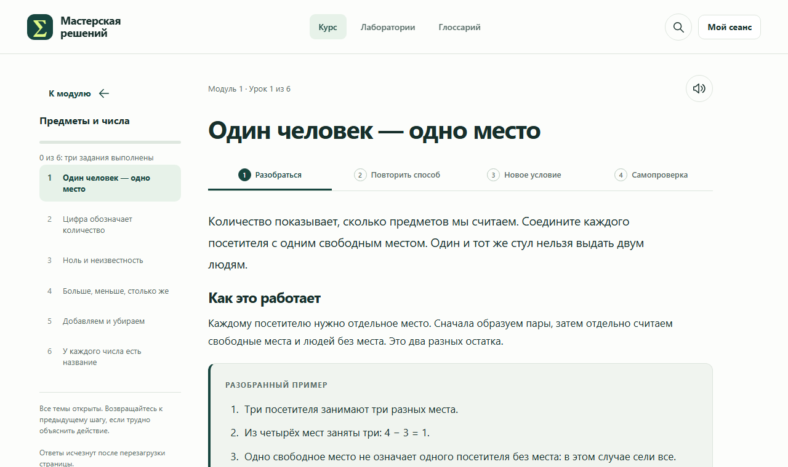
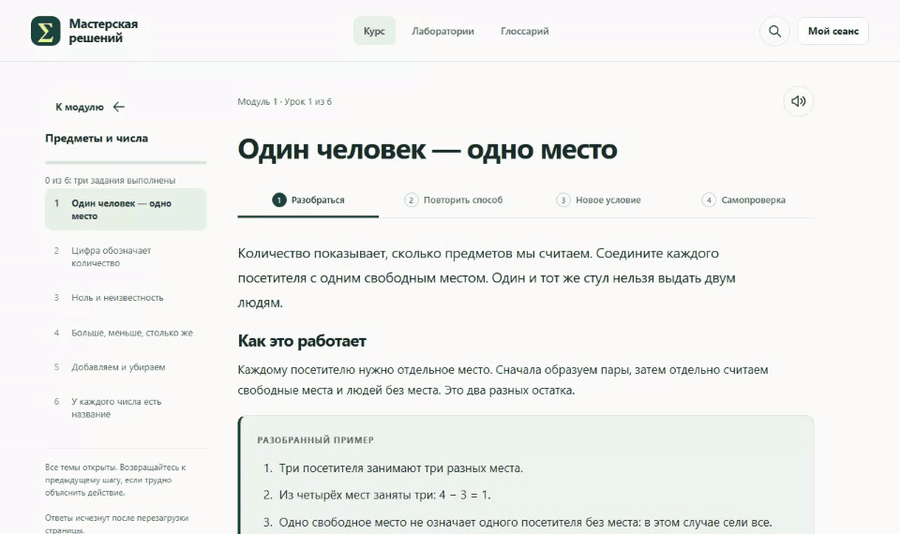
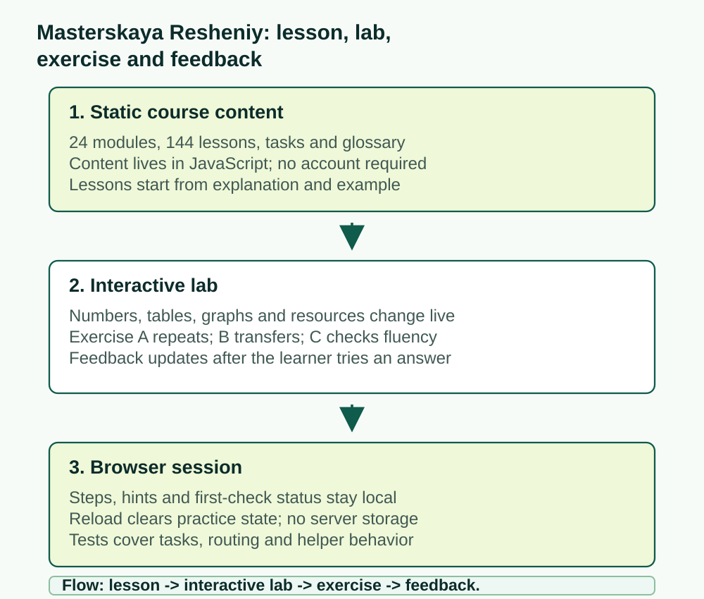
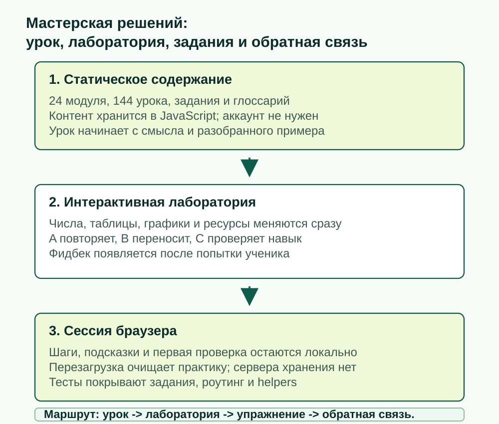

# Masterskaya Resheniy

[English](#english) | [Русский](#русский)

Live site: <https://arseniy24rus.github.io/Masterskaya-Resheniy/>

## English



*The course UI is Russian-only. This README is bilingual, but the images deliberately show the actual shipped Russian interface.*





Masterskaya Resheniy is a static interactive mathematics course. It is aimed at learners and teachers who need a slow, concrete path from everyday quantitative actions to models, forecasts, networks, matrices, uncertainty, and decision checks. The project is not a learning-management system, a certificate engine, or an evidence claim about educational effectiveness. It is a browser-based course where every page, task, and lab is bundled in the repository and can be served from GitHub Pages.

The main user scenario is deliberately repetitive: read the lesson, try the interactive lab, solve Exercise A to repeat the worked method, solve Exercise B under a changed condition, then solve Exercise C as self-check. Feedback appears after the learner acts. It may show steps, reject a common wrong answer, or mark that the answer was obtained after help. That status belongs only to the open browser session. Reloading the page clears it; there is no login, analytics tracker, server database, cookie, localStorage answer log, or automatic submission to a teacher.

The current content release, described in [QA.md](QA.md), contains 24 modules, 144 lessons, 432 ordinary lesson tasks, 42 checked mission steps, 41 interactive laboratories, 227 glossary terms, and 27 source or orientation links. The topics begin with counting and units, then move through groups, formulas, algorithms, campus systems, matrices, networks, lagged dynamics, probability, forecasting, expert mixtures, feasible programs, economics of choice, information value, verification, simulation, and a final workshop. The sources are methodological references and subject anchors; they are not presented as proof that this course improves learning outcomes.

Architecturally, the app is intentionally dependency-free. [index.html](index.html) loads static CSS and JavaScript in a fixed order. [assets/styles.css](assets/styles.css) contains layout, mobile states, focus, and print rules. [js/content.js](js/content.js) holds lessons, tasks, sources, glossary entries, missions, and lab routing. [js/engine.js](js/engine.js) and [js/learning-engine.js](js/learning-engine.js) provide numerical helpers and independent practice statistics. [js/tasks.js](js/tasks.js) renders answer fields, hints, checks, and feedback. [js/labs.js](js/labs.js) and [js/labs-learning.js](js/labs-learning.js) mount the interactive laboratories. [js/app.js](js/app.js) owns pages, routes, session memory, and practice flow. Tests live in [tests/](tests/).

The design boundary matters. All numeric situations are educational. A correct answer in the app does not prove durable mastery, professional qualification, or readiness to apply a method in real institutional management. Some advanced methods are simplified learning models. For example, local graph improvement is not advertised as a complete Louvain implementation, and expert weights are explicitly described as teaching rules. Free-text explanations are not semantically graded by the program.

Run or inspect it locally with no package installation:

```bash
python -m http.server 8000
npm test
```

The `package.json` script names `python3 -m http.server 8000`; on Windows the command may be `python -m http.server 8000`. `npm test` uses Node's built-in test runner and currently covers the answer schemas, task links, numerical helpers, independent practice isolation, and storage constraints. The previous release QA reports 505 passing tests plus Chromium/Playwright visual and interaction checks; see [QA.md](QA.md). The README visuals were recorded from the real static app with Playwright, not generated as mockups.

There is no license file in this repository. Treat the course text, task bank, visual design, and included sources conservatively: do not assume they are freely relicensable beyond the repository owner's publication context. External references remain under their own terms. Changes from prior archives are summarized in [CHANGELOG.md](CHANGELOG.md).

<details>
<summary>Pages deployment notes retained from the previous README</summary>

Upload the repository contents to the root of a GitHub repository, keeping `index.html`, `.nojekyll`, `assets/`, `js/`, tests, and docs at the top level. In GitHub, open Settings -> Pages -> Build and deployment, choose "Deploy from a branch", select `main` or your actual branch, and publish from `/(root)`. The site uses relative paths and hash routes, so the repository name does not need to be edited in source code.

</details>

## Русский


*Интерфейс курса русскоязычный. README двуязычный, но изображения показывают настоящую опубликованную русскую версию, без выдуманного перевода.*




«Мастерская решений» - статический интерактивный курс математики и моделей. Он рассчитан на ученика и преподавателя, которым нужен спокойный путь от простых количественных действий к формулам, прогнозам, сетям, матрицам, неопределённости и проверке решений. Это не LMS, не система сертификации и не доказательство образовательной эффективности. Это браузерный курс, где страницы, задания и лаборатории лежат прямо в репозитории и могут быть опубликованы через GitHub Pages.

Основной пользовательский маршрут повторяется намеренно: прочитать урок, попробовать интерактивную лабораторию, выполнить задание A как повторение способа, перенести метод в задании B на новое условие и пройти задание C как самопроверку. Обратная связь появляется после действия ученика: она может показать шаги, отвергнуть характерную ошибку или отметить, что ответ получен после подсказки. Этот статус относится только к текущей открытой странице. После перезагрузки он исчезает; здесь нет аккаунта, аналитического трекера, серверной базы, cookie, localStorage-журнала ответов или автоматической отправки преподавателю.

Текущий выпуск, описанный в [QA.md](QA.md), содержит 24 модуля, 144 урока, 432 обычных задания, 42 проверяемых шага миссий, 41 интерактивную лабораторию, 227 терминов глоссария и 27 ссылок на источники или ориентиры. Темы начинаются с счёта и единиц, затем переходят к группам, формулам, алгоритмам, кампусу как системе, матрицам, сетям, задержкам, вероятности, прогнозированию, экспертным смесям, допустимым программам, экономике выбора, ценности информации, проверке, имитации и итоговой мастерской. Источники помогают объяснять принципы, но не объявляются доказательством результата именно этого курса.

Архитектура намеренно обходится без зависимостей. [index.html](index.html) подключает CSS и JavaScript в фиксированном порядке. [assets/styles.css](assets/styles.css) задаёт макет, мобильные состояния, фокус и печать. [js/content.js](js/content.js) хранит уроки, задания, источники, глоссарий, миссии и привязку лабораторий. [js/engine.js](js/engine.js) и [js/learning-engine.js](js/learning-engine.js) содержат числовые функции и независимую статистику практики. [js/tasks.js](js/tasks.js) отвечает за поля ответа, подсказки, проверку и фидбек. [js/labs.js](js/labs.js) и [js/labs-learning.js](js/labs-learning.js) монтируют лаборатории. [js/app.js](js/app.js) управляет страницами, маршрутами, памятью сеанса и смешанной практикой. Тесты лежат в [tests/](tests/).

Границы применения проговорены явно. Все числовые ситуации учебные. Успешный ответ в приложении не доказывает устойчивое владение темой, профессиональную квалификацию или готовность применять метод в реальном управлении. Часть сложных методов показана как малая учебная модель: локальное улучшение разбиения графа не выдаётся за полную реализацию Лувена, а экспертные веса описаны как учебное правило. Свободный текст программа по смыслу не оценивает.

Запуск и проверки без установки пакетов:

```bash
python -m http.server 8000
npm test
```

В `package.json` указано `python3 -m http.server 8000`; в Windows команда часто называется `python -m http.server 8000`. `npm test` использует встроенный runner Node и проверяет схемы ответов, связность заданий, числовые helpers, изоляцию повторной практики и отсутствие постоянного хранения ответов. В предыдущем QA зафиксированы 505 успешных тестов и браузерные проверки Chromium/Playwright; подробности в [QA.md](QA.md). Визуалы для README записаны с настоящего статического приложения через Playwright, не нарисованы как макеты.

Файл лицензии в репозитории отсутствует. Поэтому текст курса, банк заданий, оформление и включённые источники следует трактовать осторожно: не предполагается свободное перелицензирование за пределами контекста публикации владельца репозитория. Внешние материалы сохраняют собственные условия. Изменения относительно предыдущих архивов перечислены в [CHANGELOG.md](CHANGELOG.md).

<details>
<summary>Сохранённые заметки о публикации на Pages</summary>

Загрузите содержимое репозитория в корень GitHub-репозитория: `index.html`, `.nojekyll`, `assets/`, `js/`, тесты и документы должны лежать на верхнем уровне. В GitHub откройте Settings -> Pages -> Build and deployment, выберите "Deploy from a branch", укажите `main` или фактическую ветку и папку `/(root)`. Сайт использует относительные пути и hash-маршруты, поэтому имя репозитория менять в коде не нужно.

</details>
